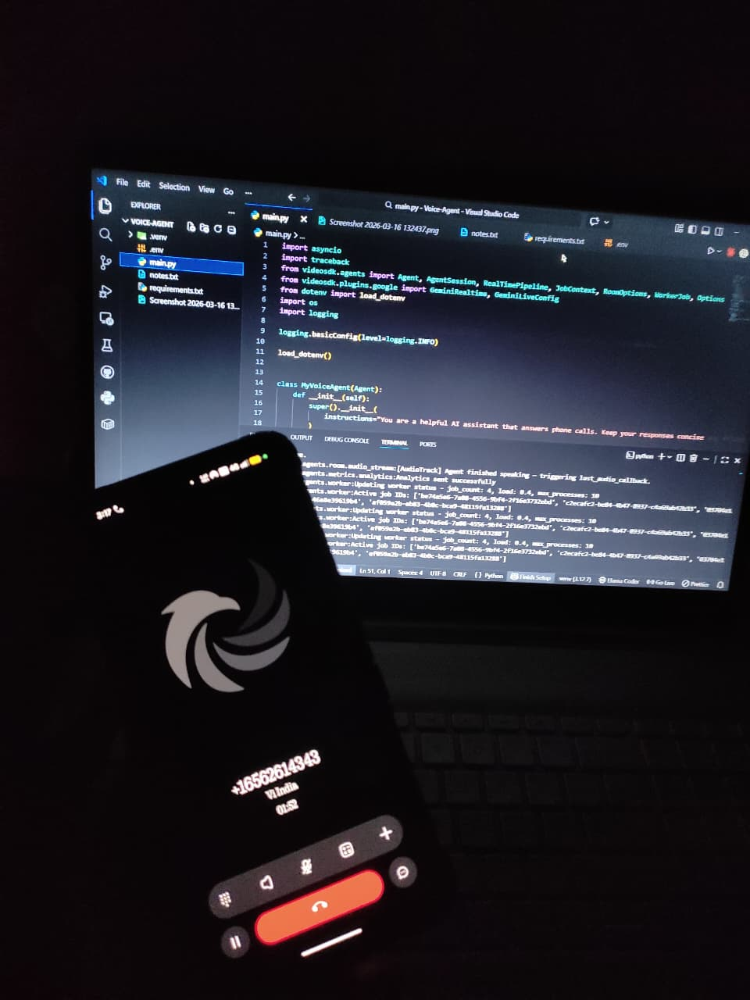

# 🎙 AI Voice Telephony Agent

A real-time AI voice agent that answers and makes phone calls using **Python**, **VideoSDK**, **Twilio**, and **Google Gemini AI**.

When someone dials the configured phone number, the call is routed through the internet to a Python-based AI agent powered by Gemini's native audio model — the agent listens and responds in real-time, like talking to an AI assistant over the phone.

---

## 🏗 Architecture

```
Phone Call
    │
    ▼
[Twilio] ── converts call to SIP ──▶ [VideoSDK Inbound Gateway]
                                              │
                                              ▼
                                      [Routing Rule]
                                              │
                                              ▼
                                      [Python Agent]
                                              │
                                              ▼
                                      [Gemini 2.5 Flash]
                                      (Real-time Audio)
```

| Component | Role |
|---|---|
| Twilio | Provides phone number, converts call to SIP |
| VideoSDK | Receives SIP call, routes it to the agent |
| Routing Rule | Matches call to agent by Agent ID |
| Python Agent | Core logic — session, personality, registration |
| Gemini AI | Processes voice input, generates spoken response |

> **What is SIP?** Session Initiation Protocol — the standard internet protocol for voice calls. Twilio converts a regular phone call into SIP so VideoSDK can handle it.

---

## 🖥 Running the Agent


## 📁 Project Structure

```
voice-agent/
├── main.py            # Agent logic, session handling, registration
├── requirements.txt   # Python dependencies
└── .env               # Secret credentials (never commit this)
```

---

## ⚙️ Setup & Installation

### 1. Clone the Repository

```bash
git clone https://github.com/yourusername/ai-voice-agent.git
cd ai-voice-agent
```

### 2. Create Virtual Environment

```bash
python3 -m venv .venv
source .venv/bin/activate        # macOS/Linux
.venv\Scripts\activate           # Windows
```

### 3. Install Dependencies

```bash
pip install -r requirements.txt
```

### 4. Configure Environment Variables

Create a `.env` file in the root directory:

```env
VIDEOSDK_AUTH_TOKEN=your_videosdk_token_here
GOOGLE_API_KEY=your_google_api_key_here
```

Get your keys:
- [VideoSDK Dashboard](https://app.videosdk.live) → Generate Auth Token
- [Google AI Studio](https://aistudio.google.com) → Get API Key

---

## 🖥 Running the Agent

```bash
python main.py
```

You should see the agent register itself with VideoSDK as `MyTelephonyAgent`. **Keep this terminal open** — the agent must stay running to receive calls.

---

## 📞 Making Calls

### Inbound Call
1. Dial your configured Twilio number from any phone
2. Agent answers automatically
3. You hear: *"Hello! I'm your real-time assistant. How can I help you today?"*
4. Speak — Gemini listens and responds in real-time

### Outbound Call (via API)

```bash
curl --request POST \
  --url https://api.videosdk.live/v2/sip/call \
  --header 'Authorization: YOUR_VIDEOSDK_TOKEN' \
  --header 'Content-Type: application/json' \
  --data '{
    "gatewayId": "your_outbound_gateway_id",
    "sipCallTo": "+91XXXXXXXXXX"
  }'
```

---

## 🔧 VideoSDK Dashboard Configuration

### Inbound Gateway
1. Go to **Telephony > Inbound Gateways > Add**
2. Enter your Twilio phone number
3. Copy the generated **Inbound Gateway URL**
4. Paste it into Twilio's **Origination SIP URI** field

### Outbound Gateway
1. Go to **Telephony > Outbound Gateways > Add**
2. Paste the **Termination SIP URI** and credentials from Twilio

### Routing Rule
1. Go to **Telephony > Routing Rules > Add**
2. Set the following:
   - **Gateway:** Your Inbound Gateway
   - **Dispatch:** Agent
   - **Agent Type:** Self Hosted
   - **Agent ID:** `MyTelephonyAgent`

> ⚠️ The Agent ID here must exactly match `agent_id` in `main.py`. A mismatch will silently break call routing.

---

## 🐛 Known Issues

| Issue | Cause | Fix |
|---|---|---|
| Agent not responding | Localhost latency with Gemini API | Deploy to cloud server |
| Call not routing | Agent ID mismatch | Match `agent_id` exactly in code and dashboard |
| Poor audio quality | Agent and SIP provider in different regions | Run agent in same region as Twilio |
| Agent doesn't answer | Python process stopped | Keep terminal open or use a process manager |

---

## ⚠️ Current Limitations

- Runs on **localhost only** — not accessible to external users without cloud deployment
- No authentication or user management
- Single phone number — no multi-user support yet
- No conversation logging or call history
- Response latency due to local machine + Gemini API roundtrip

---

## 🗺 Roadmap

- [ ] Deploy agent to cloud (Railway / Render / AWS EC2)
- [ ] Add call logging and transcript storage
- [ ] Customize agent for a specific use case (e.g. support, booking)
- [ ] Build web dashboard for managing agents and viewing logs
- [ ] Multi-user setup with dynamic phone number provisioning

---

## 🧰 Tech Stack

- [Python 3.12+](https://www.python.org/)
- [VideoSDK Agent SDK](https://www.videosdk.live/)
- [Twilio](https://www.twilio.com/)
- [Google Gemini 2.5 Flash](https://ai.google.dev/)

---
